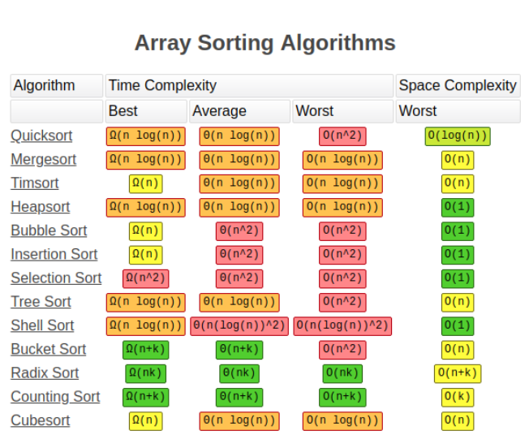

## 总览


## 插入排序 Insertion Sort
具体步骤
1. 从第二个元素（第一个要被排序的新元素）开始，从后向前扫描之前的元素序列
2. 如果当前扫描的元素大于新元素，将扫描元素移动到下一位
3. 重复步骤2，直到找到一个小于或者等于新元素的位置
4. 将新元素插入到该位置
5. 对于之后的元素重复步骤1~4

代码实现：
```
public void insertionSort(int[] array) {
    for(int i = 1; i < array.length; i++) {
        int cur = array[i];
        int insertionIndex = i - 1;
        while(insertionIndex >= 0 && array[insertionIndex] > cur) {
            array[insertionIndex + 1] = array[insertionIndex];
            insertionIndex--;
        }
        array[insertionIndex + 1] = cur;
    }
}
```