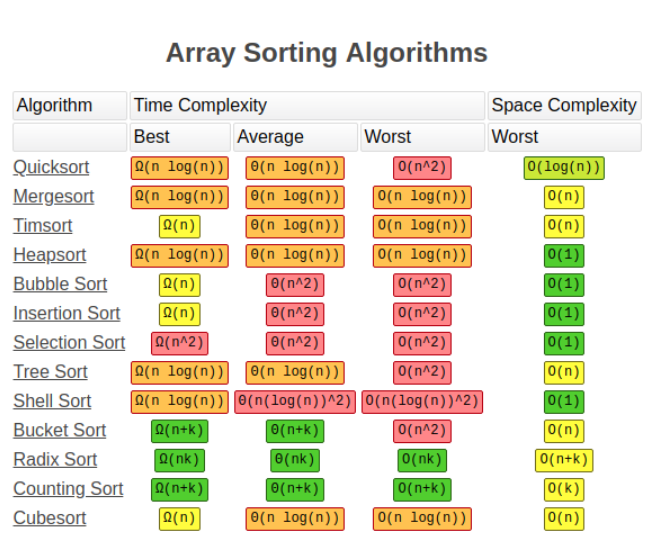

## 总览



## 插入排序 Insertion Sort
**适用于只有少量元素或者元素几乎已经偏好序的状态** 
### 具体步骤
1. 从第二个元素（第一个要被排序的新元素）开始，从后向前扫描之前的元素序列
2. 如果当前扫描的元素大于新元素，将扫描元素移动到下一位
3. 重复步骤2，直到找到一个小于或者等于新元素的位置
4. 将新元素插入到该位置
5. 对于之后的元素重复步骤1~4

代码实现：
```
public void insertionSort(int[] array) {
    for(int i = 1; i < array.length; i++) {
        //记录所要插入的数据
        int cur = array[i];
        //循环要插入数据前的数组
        int insertionIndex = i - 1;
        //如果大于插入的数据，将数据后移一位
        while(insertionIndex >= 0 && array[insertionIndex] > cur) {
            array[insertionIndex + 1] = array[insertionIndex];
            insertionIndex--;
        }
        //插入
        array[insertionIndex + 1] = cur;
    }
}
```

### 算法评价
当插入排序作用于基于指针的输入数据时，元素交换将会变得更为高效。
>时间复杂度：O(n²)
空间复杂度：O(1)

## 快排 QuickSort
> 快排的基本概念就是选取一个目标元素，然后将目标元素放到数组中正确的位置。然后根据排好序后的元素，将数组切分为两个子数组，用相同的方法，在没有排好序的范围使用相同的操作。

### 具体步骤
1. 对于当前的数组，取最后一个元素当做基准数（pivot）
2. 将所有比基准数小的元素排到基准数之前，比基准数大的排在基准数之后
3. 当基准数被放到准确的位置之后，根据基数数的位置将元素切分为前后两个子数组
4. 对子数组采用步骤1~4的递归操作，直到子数组的长度小于等于1为止

```
public void quickSort(int[] array, int left, int right) {
    if(left >= right) return;
    int partitionIndex = partition(array, left, right);
    quickSort(array, left, partitionIndex - 1);
    quickSort(array, partitionIndex + 1, right);
}
public int partition(int[] array, int left, int right) {
    //选取基准数
    int pivot = array[right];
    int leftIndex = left;
    int rightIndex = right - 1;
    while(true) { 
        //扫描左侧、右侧数组，如果不符合大小关系，进行交换。
        while(leftIndex < right & array[leftIndex] <= pivot) {
            leftIndex++;
        }
        while(rightIndex >= left && array[rightIndex] > pivot) {
            rightIndex--;
        }
        if (leftIndex > rightIndex) break;
        swap(array, leftIndex, rightIndex);
    }
    swap(array, leftIndex, right); // swap pivot to the right position
    return leftIndex;
}
// 交换数据
public void swap(int[] array, int left, int right) {
    int temp = array[left];
    array[left] = array[right];
    array[right] = temp;
}
```

### 算法评价
> 时间复杂度：O(n^2)，平均时间复杂度：O(nlogN）
空间复杂度：O(n)，平均空间复杂度：O(logN)

## 归并排序 MergeSort
归并排序和快排一样，也是一种分而治之算法，简单理解就是将大问题变为小问题，然后把所有小问题都解决掉，大问题就迎刃而解了。其中主要包括两个步骤：

+ 切分步骤：将大问题变为小问题，通过递归解决更小的子问题。
+ 解决步骤：将小问题的结果合并，以此找到大问题的答案。

递归具体步骤
1. 递归切分当前数组
2. 如果当前数组数量小于等于1，无需排序，直接返回结果
3. 否则将当前数组分为两个子数组，递归排序这两个子数组
4. 在子数组排序结束后，将子数组的结果归并成排好序的数组

```
public void mergeSort(int[] array) {
    int[] helper = copy(array);
    mergeSort(array, helper, 0, array.length - 1);
    return array;
}
public void mergeSort(int[] array, int[] helper, int left, int right) {
    if(right - left < 1) return;
    int mid = left + (right - left) / 2;
    mergeSort(array, helper, left, mid);
    mergeSort(array, helper, mid + 1, right);
    merge(array, helper, left, mid, right);
}
public void merge(int[] array, int[] helper, int left, int mid, int right) {
    for(int i = left; i <= right; i++) {
        helper[i] = array[i];
    }
    int leftStart = left;
    int rightStart = mid + 1;
    for (int i = left; i <= right; i++) { 
        if (leftStart > mid) {   
            array[i] = helper[rightStart++];
        } else if (rightStart > right) {
            array[i] = helper[leftStart++];
        } else if (helper[leftStart] < helper[rightStart]) {
            array[i] = helper[leftStart++];
        } else {
            array[i] = helper[rightStart++];
        }
     }
}
public int[] copy(int[] array) {
     int[] newArray = new int[array.length];
     for(int i = 0; i < array.length; i++) { 
         newArray[i] = array[i];
     }
     return newArray;
}
```
> 时间：O(nlogN)
空间：O(N)